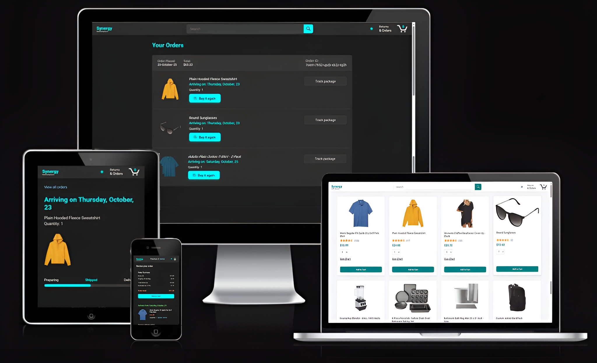

# 🛍️ Synergy Marketplace

a fully responsive, scalable e-commerce frontend that simulates a complete user purchase flow, featuring a custom responsive UI , functional Dark Mode toggle, state management using pure JavaScript.

 🚀 **Live demo:** [https://aymvnibrahim.github.io/synergy-marketplace/](https://aymvnibrahim.github.io/synergy-marketplace/)

💻 **Tech Stack:** HTML, CSS, Vanilla JavaScript

✨ **Features:**
- Dynamic Cart Logic using JavaScript for state management.
- Custom Dark Mode toggle functionality across the entire site.
- Responsive UI built with advanced CSS Flexbox and Grid.
- Simulated user flow: Products, Checkout, Orders, and Tracking pages.

